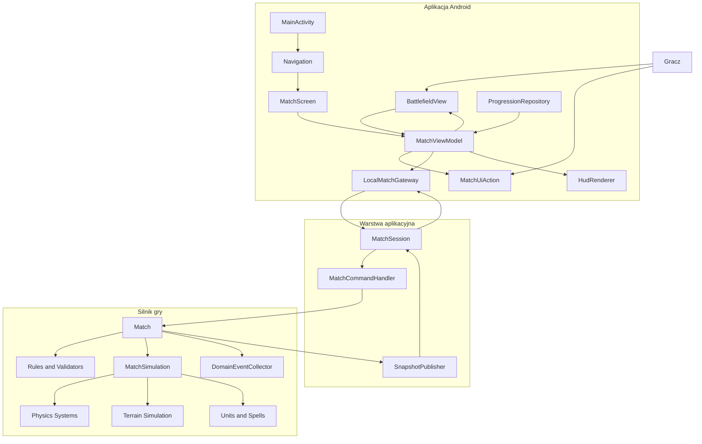
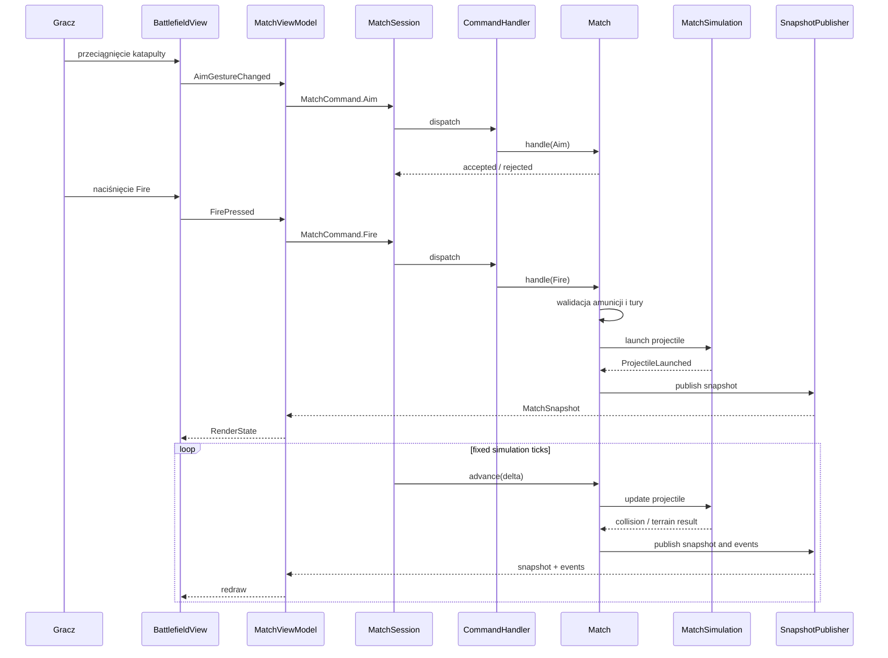
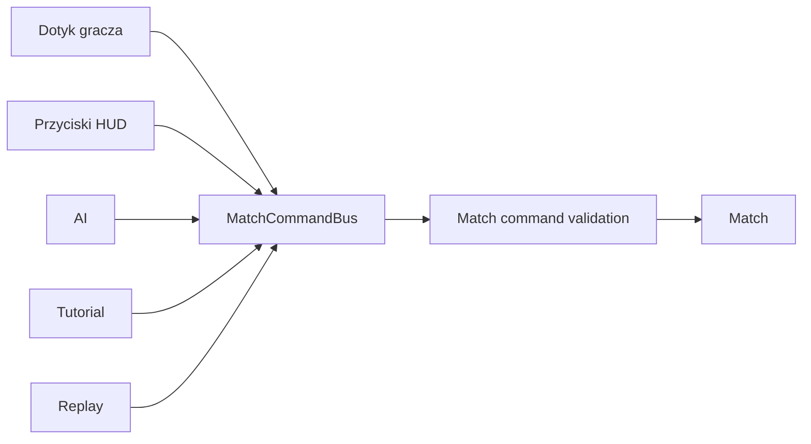

# Architektura Urkaaaz

## 1. Zakres dokumentu

Urkaaaz jest obecnie grą wyłącznie mobilną na Androida. Nie projektujemy teraz
serwera, API, logowania, matchmakingu ani komunikacji sieciowej.

Architektura ma jednak od początku zachować granicę pomiędzy:

- silnikiem i regułami gry,
- aplikacją mobilną,
- interfejsem użytkownika,
- renderingiem,
- zapisem postępu,
- zasobami i platformą Android.

W przyszłości taki podział ma umożliwić przeniesienie silnika do osobnego procesu
lub na serwer bez przepisywania reguł gry i bez uzależnienia ich od Androida.

Najważniejsza zasada:

> UI może korzystać z kontraktów silnika, ale nie może znać jego implementacji.
> Silnik nie może znać UI, Androida ani sposobu prezentacji danych.

---

## 2. Cele architektury

Architektura powinna:

- utrzymywać reguły gry poza kodem Androida;
- umożliwiać testowanie silnika bez emulatora i bez `Context`;
- uniemożliwiać UI bezpośrednią mutację stanu gry;
- rozdzielać symulację, komendy i odczyt stanu;
- pozwalać na użycie tego samego silnika przez kampanię, tryb testowy i AI;
- umożliwiać późniejsze wydzielenie silnika do osobnego modułu;
- ograniczać odpowiedzialność `Activity` i custom view;
- unikać kolejnej fasady kopiującej API silnika;
- zachować istniejące zachowanie gry, timing, balans i zasoby;
- umożliwić stopniową migrację bez przepisywania całej gry jednorazowo.

---

## 3. Mapa komponentów

Poniższy diagram pokazuje docelową komunikację w obecnej wersji mobilnej.
Nie oznacza on jeszcze istnienia serwera ani komunikacji sieciowej.



### Właściciele odpowiedzialności

| Komponent | Jest właścicielem | Nie jest właścicielem |
|---|---|---|
| `MainActivity` | lifecycle Androida i wejście do aplikacji | reguł meczu i stanu gameplayu |
| `MatchScreen` | składania ekranu meczu | symulacji |
| `MatchViewModel` | stanu prezentacyjnego ekranu | stanu domeny |
| `BattlefieldView` | gestów, kamery i rysowania | obrażeń i kolizji |
| `HudRenderer` | prezentacji HUD-u | zasobów i zwycięstwa |
| `LocalMatchGateway` | połączenia aplikacji z lokalnym meczem | reguł gry |
| `MatchSession` | lifecycle jednego meczu i komunikacji z aplikacją | szczegółowej fizyki |
| `Match` | prawdy o stanie meczu | Androida i persystencji |
| `MatchSimulation` | wykonywania kroków symulacji | nawigacji i UI |
| `Rules and Validators` | sprawdzania, czy akcja jest dozwolona | renderowania |
| `SnapshotPublisher` | tworzenia bezpiecznego odczytu | mutowania meczu |
| `ProgressionRepository` | zapisu kampanii i postępu | zapisu stanu runtime meczu |

### Jedyny właściciel stanu meczu

```text
Match
  └── prywatny stan domenowy
      ├── MatchState
      ├── BattlefieldState
      ├── ProjectileState
      ├── UnitState
      ├── ResourceState
      └── SpellState
```

Pozostałe komponenty nie przechowują drugiej kopii tego stanu. Mogą posiadać:

- `MatchSnapshot` — niemutowalny odczyt;
- `MatchUiState` — dane przygotowane pod konkretny ekran;
- cache bitmap i animacji;
- stan kamery;
- stan animacji lokalnej;
- stan nawigacji.

Nie mogą przechowywać własnych kopii zdrowia, pozycji, zasobów ani wyniku meczu.

---

## 4. Kanały komunikacji

Komponenty komunikują się tylko przez określone kontrakty.

### 4.1. Wejście użytkownika

```text
Gesture / Button
      ↓
MatchUiAction
      ↓
MatchViewModel
      ↓
MatchCommand
      ↓
MatchSession
```

`MatchUiAction` jest zdarzeniem interfejsu, np.:

```text
AimGestureChanged
FirePressed
AmmoSelected
UnitDeployPressed
SpellPressed
SendWavePressed
```

`MatchUiAction` nie jest jeszcze komendą domenową. ViewModel tłumaczy akcję
ekranu na `MatchCommand`.

Przykład:

```text
FirePressed
    → MatchCommand.Fire(player = LEFT)
```

UI nie wywołuje metod `Match`, `MatchSimulation`, `ProjectileSystem` ani
`UnitSystem` bezpośrednio.

### 4.2. Komenda aplikacyjna

```text
MatchCommand
      ↓
MatchSession.dispatch(command)
      ↓
MatchCommandHandler
      ↓
Match.handle(command)
```

`MatchCommandHandler` odpowiada za przepływ, ale reguła pozostaje w domenie.
Na przykład handler może znaleźć mecz i przekazać komendę, ale nie może sam
decydować, czy gracz ma wystarczająco many.

### 4.3. Odczyt stanu

```text
Match
  → SnapshotPublisher
  → MatchSnapshot
  → MatchSession
  → LocalMatchGateway
  → MatchViewModel
  → MatchUiState
  → BattlefieldView / HUD
```

Snapshot jest jednokierunkowym odczytem. UI nie odsyła zmodyfikowanego
snapshotu z powrotem do silnika.

### 4.4. Eventy gameplayowe

```text
Match
  → DomainEventCollector
  → MatchEvent
  → MatchSession
  → MatchViewModel
  → UI effect
```

Event jest faktem, który już zaszedł. Przykłady:

```text
ProjectileLaunched
ProjectileImpacted
FortressDamaged
UnitDestroyed
SpellActivated
MatchFinished
```

Event może spowodować:

- odtworzenie dźwięku;
- animację trafienia;
- wibrację;
- komunikat HUD-u;
- rozpoczęcie kolejnego kroku tutoriala.

Event nie może być używany przez UI do samodzielnego zmieniania stanu meczu.

### 4.5. Postęp i persystencja

```text
MatchFinished
      ↓
MatchViewModel / Application service
      ↓
ProgressionService
      ↓
ProgressionRepository
      ↓
DataStore / SQLite / SharedPreferences adapter
```

Stan meczu runtime i progresja gracza są różnymi odpowiedzialnościami.
`Match` nie zapisuje bezpośrednio złota, odblokowań ani stanu kampanii.

---

## 5. Pełny przepływ strzału

Poniższy przepływ jest podstawowym scenariuszem gry.



### Co robi każda warstwa?

| Etap | Odpowiedzialność |
|---|---|
| gest | zebranie pozycji palca |
| `MatchUiAction` | opis akcji ekranu |
| `MatchViewModel` | mapowanie na komendę |
| `MatchCommand` | intencja gameplayowa |
| `MatchCommandHandler` | znalezienie sesji i przekazanie komendy |
| `Match` | walidacja reguł i zmiana stanu |
| `MatchSimulation` | fizyka i systemy czasu |
| `MatchSnapshot` | bezpieczny odczyt |
| renderer | prezentacja wyniku |

---

## 6. Cykl życia meczu

```text
CREATED
  ↓
CONFIGURED
  ↓
READY
  ↓
RUNNING
  ↓
FINISHED
  ↓
RESULT_SAVED
```

### Utworzenie

`MatchScenario` jest tworzony przez warstwę aplikacyjną na podstawie:

- poziomu kampanii;
- loadoutu gracza;
- wybranego trybu;
- poziomu trudności;
- seeda;
- parametrów testowych.

`MatchScenario` trafia do fabryki domenowej. UI nie tworzy ręcznie katapult,
fortec ani systemów.

### Uruchomienie

`MatchSession.start()`:

1. tworzy `Match`;
2. publikuje pierwszy snapshot;
3. publikuje `MatchStarted`;
4. uruchamia zegar symulacji;
5. umożliwia przyjmowanie komend.

### Aktualizacja

```text
fixed tick
  → pobranie komend
  → uporządkowanie komend
  → walidacja
  → wykonanie komend
  → krok symulacji
  → eventy
  → snapshot
  → aktualizacja UI
```

### Zakończenie

`Match` sam rozstrzyga:

- zniszczenie fortecy;
- zwycięstwo w scenariuszu;
- przegraną;
- timeout;
- poddanie;
- warunek bossowy.

UI tylko prezentuje wynik i przekazuje go do warstwy progresji.

---

## 7. Rozdzielenie stanu domenowego od stanu UI

### Stan domenowy

Znajduje się wyłącznie wewnątrz `Match` i systemów symulacji:

```text
MutableMatchState
├── catapult internals
├── projectile internals
├── terrain heightmap
├── unit internals
├── cooldowns
├── mana and supply
└── random state
```

### Snapshot domenowy

Tworzony przez `SnapshotPublisher`:

```text
MatchSnapshot
├── CatapultSnapshot
├── FortressSnapshot
├── UnitSnapshot
├── ProjectileSnapshot
├── TerrainSnapshot
├── ResourceSnapshot
└── MatchStatusSnapshot
```

### Stan UI

Tworzony w `MatchViewModel`:

```text
MatchUiState
├── renderSnapshot
├── selectedAmmo
├── hudVisibility
├── statusMessage
├── tutorialOverlay
├── cameraMode
└── availableButtons
```

`MatchUiState` może zawierać stan prezentacyjny, ale nie może stać się drugim
właścicielem stanu gameplayu.

---

## 8. Warstwa renderowania i kamera

Renderowanie powinno mieć następujący przepływ:

```text
MatchSnapshot
      ↓
RenderStateMapper
      ↓
RenderState
      ↓
BattlefieldRenderer
      ├── TerrainRenderer
      ├── FortressRenderer
      ├── CatapultRenderer
      ├── UnitRenderer
      ├── ProjectileRenderer
      └── EffectsRenderer
```

Kamera jest stanem UI:

- `cameraX`;
- `cameraY`;
- `zoom`;
- tryb śledzenia pocisku;
- tryb photo mode;
- aktywny fokus.

Kamera może reagować na snapshot i eventy, ale nie może modyfikować pozycji
obiektów w meczu.

Przykład:

```text
ProjectileLaunched
  → CameraController.startFollowing(projectileId)
```

Kamera śledzi `projectileId`, a nie referencję do obiektu domenowego.

---

## 9. AI i źródła komend

Wszystkie źródła komend powinny korzystać z jednego wejścia:



AI nie ma specjalnej ścieżki omijającej walidację. Jeżeli AI ma wykonać strzał,
wysyła dokładnie taką samą komendę jak gracz.

Tutorial również wysyła zwykłe komendy. Specjalne ograniczenia tutoriala są
częścią `MatchScenario` albo konfiguracji reguł, a nie bezpośrednim dostępem
do silnika.

---

## 10. Kontrakty komponentów

Minimalne kontrakty powinny wyglądać koncepcyjnie tak:

```text
MatchSession
├── dispatch(MatchCommand): CommandResult
├── observeSnapshots(): Flow<MatchSnapshot>
├── observeEvents(): Flow<MatchEvent>
├── start()
├── pause()
└── stop()
```

```text
MatchCommandBus
└── dispatch(MatchCommand): CommandResult
```

```text
SnapshotPublisher
└── createSnapshot(match): MatchSnapshot
```

```text
MatchRepository
├── create(scenario): MatchId
├── get(matchId): Match
└── remove(matchId)
```

W wersji mobilnej `MatchRepository` może być wyłącznie pamięciowe.
W przyszłości może zostać zastąpione przez implementację serwerową bez zmian
w UI i domenie.

---

## 11. Błędy i odrzucenie komend

Nieprawidłowa komenda nie powinna kończyć się wyjątkiem przechwyconym jako
pozorny sukces.

```text
CommandResult
├── Accepted
└── Rejected(reason)
```

Przykładowe powody:

```text
CommandRejectionReason
├── NotYourTurn
├── MatchNotRunning
├── CatapultDestroyed
├── ReloadInProgress
├── AmmoUnavailable
├── InsufficientMana
├── UnitUnavailable
├── SpellNotEquipped
└── InvalidAim
```

Warstwa UI mapuje te powody na komunikat lub stan przycisku. Nie implementuje
własnej, konkurencyjnej walidacji.

---

## 12. Reguły pakietów

### `domain`

Może zależeć wyłącznie od standardowej biblioteki Kotlin i innych pakietów
domenowych.

### `simulation`

Może zależeć od `domain`. Nie może zależeć od `ui`, Androida ani persystencji.

### `application`

Może zależeć od `domain`, `simulation` i kontraktów. Definiuje porty, ale nie
zna adapterów Androida.

### `contracts`

Zawiera proste, stabilne modele komunikacyjne. Nie może zawierać referencji do
`View`, `Activity` ani klas systemów symulacji.

### `ui`

Może zależeć od kontraktów i interfejsów aplikacyjnych. Nie może zależeć od
konkretnych klas silnika.

### `platform`

Zawiera implementacje dla Androida, zasobów, zegara, audio i persystencji.

---

## 13. Obecny zakres a przyszłe rozszerzenie

### Teraz

```text
Android UI
  → LocalMatchGateway
  → MatchSession
  → Match
```

Mecz działa lokalnie w pamięci urządzenia. Nie ma serwera ani protokołu
sieciowego.

### Później

```text
Android UI
  → RemoteMatchGateway
  → transport sieciowy
  → serwerowa MatchSession
  → Match
```

Wymiana `LocalMatchGateway` na `RemoteMatchGateway` nie powinna wymagać zmiany
rendererów, HUD-u ani reguł domenowych.

To jest główny powód rozdzielenia UI i silnika już teraz.

---

## 14. Zasady anty-God-Object

Nie tworzyć klas, które jednocześnie:

- przechowują stan meczu;
- wykonują fizykę;
- obsługują input;
- renderują;
- sterują AI;
- zarządzają lifecycle;
- zapisują progres;
- pokazują dialogi.

Jeżeli klasa przekracza jedną główną odpowiedzialność, należy rozważyć
wydzielenie komponentu według konkretnego kontekstu:

```text
ProjectileSimulation
TerrainSimulation
ResourceService
MatchCommandHandler
MatchSnapshotPublisher
CameraController
ProgressionService
```

Nie należy wydzielać pustych klas tylko po to, aby zwiększyć liczbę plików.
Każdy komponent musi mieć jednoznacznego właściciela odpowiedzialności.

---

## 15. Plan migracji

Migrację należy wykonywać pionowymi, weryfikowalnymi etapami:

1. Zatrzymać rozwój szerokich fasad nad obecnym silnikiem.
2. Zdefiniować `MatchCommand`, `CommandResult`, `MatchEvent` i `MatchSnapshot`.
3. Zdefiniować `MatchScenario`.
4. Wydzielić prywatny stan meczu z obecnego obiektu silnika.
5. Wydzielić symulację pocisków, terenu, jednostek i zaklęć.
6. Utworzyć `MatchSession` jako jedyny punkt dostępu aplikacji do meczu.
7. Przepiąć tryb kampanii na lokalną sesję meczu.
8. Przepiąć AI na snapshoty i komendy.
9. Przepiąć HUD na `MatchUiState`.
10. Przepiąć `BattlefieldView` na `RenderState`.
11. Usunąć publiczne kolekcje silnika.
12. Usunąć bezpośrednie zależności UI od implementacji silnika.
13. Dodać testy granic pakietów i zachowania.

Każdy etap musi kończyć się:

- testami domeny;
- testami aplikacyjnymi;
- testem architektonicznym;
- sprawdzeniem braku starej ścieżki;
- porównaniem zachowania gry.

---

## 16. Definicja poprawnej komunikacji

Architektura jest poprawnie rozdzielona, gdy:

```text
UI → MatchUiAction
ViewModel → MatchCommand
Application → MatchSession
Session → Match
Match → Simulation
Simulation → MatchEvent
Match → MatchSnapshot
Snapshot → ViewModel
ViewModel → UI
```

oraz nigdy:

```text
UI → GameEngine.fire()
UI → GameEngine.activeProjectiles
Renderer → GameEngine
Activity → ProjectileSystem
AI → publiczne kolekcje silnika
Tutorial → prywatny stan meczu
```

Najważniejszym testem architektury nie jest liczba interfejsów, tylko możliwość
zmiany sposobu uruchomienia meczu bez zmiany reguł gry i bez przepisywania UI.

---

## 17. Zasady przyszłego serwera

Serwer nie jest obecnie implementowany. Granice powinny jednak umożliwiać
późniejsze użycie tych samych kontraktów:

- `MatchCommand` jako wejście;
- `MatchSnapshot` jako odczyt;
- `MatchEvent` jako fakty gameplayowe;
- deterministyczny tick;
- jawny seed;
- brak zaufania do klienta;
- brak mutowalnego stanu przesyłanego do UI.

W przyszłości serwer może stać się właścicielem `MatchSession`, ale nie powinno
to wymagać zmian w `Match`, `MatchSimulation`, `MatchCommand` ani
`MatchSnapshot`.

---

## 18. Definicja ukończenia

Architektura jest gotowa do implementacji, gdy:

- istnieje jeden właściciel stanu meczu;
- komendy są jedynym wejściem do zmiany stanu;
- snapshot jest jedynym odczytem dla UI;
- eventy są jedynym źródłem efektów wynikających z gameplayu;
- UI nie zna implementacji silnika;
- renderery nie znają `Match`;
- AI korzysta z tych samych komend co gracz;
- kampania nie jest wymieszana z symulacją;
- persystencja nie zapisuje bezpośrednio grafu silnika;
- testy domeny nie wymagają Androida;
- `LocalMatchGateway` można później zastąpić `RemoteMatchGateway`;
- nie istnieją równoległe, kompatybilnościowe ścieżki starej architektury.

Ten dokument opisuje projekt architektury. Nie oznacza żadnego elementu jako
zaimplementowanego.

---

## 19. Zasady zależności

Zależności płyną do środka:

```text
Android / Canvas / Resources / Persistence
                ↓
         Adapters / Platform
                ↓
        Application / Use cases
                ↓
       Domain / Simulation
```

### Silnik nie może zależeć od:

- `android.*`;
- `Activity`, `View`, `Canvas`, `Context`;
- `Handler`, `Choreographer`, `SoundPool`;
- XML-i i zasobów Androida;
- `SharedPreferences`;
- klas UI;
- AI zależnego od UI;
- JSON, HTTP, WebSocketów i konkretnej bazy danych.

### UI nie może:

- znać `GameEngine` jako konkretnej klasy;
- przechowywać publicznych mutowalnych kolekcji silnika;
- zmieniać pól domenowych bez komendy;
- obliczać obrażeń, kolizji, zwycięstwa lub wyniku zaklęcia;
- sterować systemami silnika bezpośrednio;
- przekazywać `GameEngine` do rendererów;
- posiadać drugiej, uproszczonej kopii stanu gry.

### Zakazane obejścia:

- `getEngine()`;
- `unwrap()`;
- `asGameEngine()`;
- szeroka fasada przekazująca całe API silnika;
- aliasy kompatybilności maskujące starą zależność;
- `RenderContext` służący jako most do ukrytego silnika;
- publiczne `MutableMap` i `MutableList` wystawione do UI.

---

## 20. Docelowy podział pakietów

Na obecnym etapie projekt może pozostać jednym modułem Gradle. Pakiety powinny
jednak odzwierciedlać przyszłe granice modułów.

```text
com.urkaaaz.game
├── domain
│   ├── match
│   ├── player
│   ├── artillery
│   ├── fortress
│   ├── terrain
│   ├── unit
│   ├── spell
│   ├── resource
│   ├── projectile
│   └── event
│
├── simulation
│   ├── MatchSimulation
│   ├── SimulationStep
│   ├── ProjectileSimulation
│   ├── UnitSimulation
│   ├── TerrainSimulation
│   ├── SpellSimulation
│   ├── CollisionSimulation
│   └── WindSimulation
│
├── application
│   ├── match
│   ├── campaign
│   ├── loadout
│   ├── tutorial
│   └── progression
│
├── contracts
│   ├── MatchCommand
│   ├── MatchSnapshot
│   ├── MatchEvent
│   ├── MatchError
│   └── MatchScenario
│
├── ai
│   ├── AiAgent
│   ├── AiDecision
│   └── AiStrategy
│
├── platform
│   ├── persistence
│   ├── audio
│   ├── assets
│   └── clock
│
└── ui
    ├── navigation
    ├── screen
    ├── match
    ├── rendering
    ├── input
    └── controllers
```

Pakiety `domain`, `simulation` i `contracts` powinny być możliwe do przeniesienia
do osobnego modułu bez importowania kodu z `ui` lub `platform`.

---

## 21. Domena gry

### 5.1. `Match`

`Match` jest właścicielem stanu jednego meczu i reguł jego przebiegu.

Powinien zarządzać:

- fazą meczu;
- aktualną turą lub aktywnym graczem;
- katapultami;
- fortecami;
- centralnym celem;
- pociskami;
- jednostkami oblężniczymi;
- zasobami;
- amunicją;
- zaklęciami;
- wiatrem;
- deformacją terenu;
- warunkami zwycięstwa;
- seedem losowości.

`Match` nie powinien być klasą zawierającą cały kod fizyki, AI, renderowania
i lifecycle Androida. Powinien koordynować wyspecjalizowane systemy.

### 5.2. Komendy

UI i AI wysyłają intencje, a nie zmieniają stan bezpośrednio:

```text
MatchCommand
├── SelectAmmo
├── Aim
├── Fire
├── DeployUnit
├── SendWave
├── CastSpell
├── Surrender
└── AdvanceSimulation
```

Komenda powinna być jedynym wejściem do zmiany stanu meczu.

Przykładowe zasady:

- `Fire` sprawdza przeładowanie, aktywną amunicję i stan katapulty;
- `DeployUnit` sprawdza dostępność jednostki, zasoby i limit;
- `CastSpell` sprawdza wyposażenie, manę, cooldown i warunki zaklęcia;
- `AdvanceSimulation` wykonuje krok symulacji o określonym czasie.

### 5.3. Eventy

Systemy domenowe mogą generować fakty:

```text
MatchEvent
├── ProjectileLaunched
├── ProjectileImpacted
├── TerrainDeformed
├── FortressDamaged
├── UnitSpawned
├── UnitDestroyed
├── SpellActivated
├── ResourcesChanged
├── MatchWon
└── MatchLost
```

Eventy są potrzebne dla:

- animacji;
- dźwięków;
- HUD-u;
- tutoriala;
- debugowania;
- przyszłego replaya;
- przyszłej synchronizacji sieciowej.

UI może reagować na event, ale nie może na jego podstawie samodzielnie
wyliczać wyniku gameplayu.

---

## 22. Symulacja specyficzna dla Urkaaaz

Gra ma kilka elementów, które muszą należeć do silnika, a nie do UI:

- lot pocisków po trajektorii balistycznej;
- różne typy amunicji;
- wiatr i jego zmienność;
- kolizje z terenem;
- eksplozje i promienie obrażeń;
- niszczenie oraz deformacja terenu;
- katapulty i fortece;
- jednostki poruszające się po terenie;
- garrison i wysyłanie fal;
- tarcze fortec;
- runiczne bastiony;
- pułapki lodowe;
- chmury plagi;
- zaklęcia czasowe;
- centralne cele i bossowie;
- warunki zwycięstwa;
- wynik i nagrody.

UI może pokazywać trajektorię podglądową, ale wynik rzeczywistego strzału
wylicza wyłącznie symulacja.

### Stały krok symulacji

Symulacja powinna działać na kontrolowanym kroku czasu:

```text
simulation.update(deltaSeconds)
```

Docelowo należy ustalić jeden stały krok, np. 30 lub 60 Hz. Renderowanie
Androida nie może decydować o czasie symulacji.

Dzięki temu:

- wynik nie zależy od FPS urządzenia;
- testy są powtarzalne;
- AI może korzystać z tych samych reguł;
- przyszłe przeniesienie silnika na serwer będzie prostsze.

### Kontrolowana losowość

Losowość powinna mieć jawny seed meczu:

- wiatr;
- rozrzut;
- efekty specjalne;
- warianty zachowania AI;
- elementy zależne od losowania.

Nie należy używać bezpośrednio globalnego `Random.Default` w regułach gry.

---

## 23. Read model dla UI

UI nie powinno otrzymywać obiektów domenowych, które może zmienić.

Silnik publikuje niemutowalny snapshot:

```text
MatchSnapshot
├── MatchStatusSnapshot
├── PlayerSnapshot
├── CatapultSnapshot
├── FortressSnapshot
├── UnitSnapshot
├── ProjectileSnapshot
├── TerrainSnapshot
├── ResourceSnapshot
├── EffectSnapshot
├── WindSnapshot
└── AvailableActions
```

Snapshot powinien zawierać wyłącznie dane:

- bez setterów;
- bez metod zmieniających mecz;
- bez referencji do `Match`;
- bez referencji do systemów;
- z kopiami kolekcji;
- z prostymi typami przeznaczonymi do renderowania i serializacji.

Przykładowe dane:

```text
FortressSnapshot(
    team,
    centerX,
    width,
    height,
    health,
    maxHealth,
    shieldState
)
```

```text
ProjectileSnapshot(
    id,
    x,
    y,
    rotation,
    ammoType,
    flightState
)
```

Wewnętrzny stan silnika może używać klas bogatszych i mutowalnych, ale nigdy
nie powinien ich wystawiać do `ui`.

---

## 24. Warstwa aplikacyjna

Warstwa aplikacyjna łączy UI z domeną, ale nie zawiera reguł fizyki.

Głównym komponentem może być:

```text
MatchApplicationService
```

Odpowiada za:

- przyjęcie komendy;
- przekazanie jej do meczu;
- zebranie eventów;
- aktualizację snapshotu;
- powiadomienie obserwatorów;
- obsługę rozpoczęcia i zakończenia meczu.

Interfejs aplikacyjny:

```text
MatchSession
├── observeSnapshot()
├── observeEvents()
├── dispatch(command)
└── advance(deltaSeconds)
```

UI zna `MatchSession` albo wąski gateway aplikacyjny, ale nie zna implementacji
silnika.

---

## 25. Android UI

### `MainActivity`

Powinna odpowiadać za:

- lifecycle Androida;
- utworzenie zależności;
- nawigację najwyższego poziomu;
- obsługę konfiguracji ekranu.

Nie powinna zawierać:

- reguł meczu;
- logiki AI;
- logiki obrażeń;
- tworzenia i konfiguracji wszystkich systemów gry;
- bezpośredniego odczytu kolekcji silnika;
- logiki wszystkich ekranów w jednym pliku.

### `MatchViewModel`

Powinien:

- obserwować `MatchSnapshot`;
- wysyłać `MatchCommand`;
- mapować dane meczu na stan HUD-u;
- obsługiwać komunikaty błędów;
- utrzymywać stan ekranu meczu.

### `BattlefieldView`

Powinien odpowiadać za:

- gesty;
- kamerę;
- transformację współrzędnych;
- cykl rysowania;
- renderowanie snapshotu;
- lokalne animacje wizualne.

Nie powinien:

- zmieniać stanu domeny;
- wywoływać metod silnika;
- znać `Match`;
- znać `Activity`;
- posiadać logiki AI.

### Renderery

Renderery powinny otrzymywać dane renderowania:

```text
TerrainRenderer.render(terrainSnapshot)
FortressRenderer.render(fortressSnapshot)
UnitRenderer.render(unitSnapshot)
ProjectileRenderer.render(projectileSnapshot)
EffectsRenderer.render(effectSnapshot)
```

Renderer nie powinien otrzymywać ani `GameEngine`, ani `Match`, ani `GameView`.

---

## 26. AI

AI powinno być uczestnikiem meczu, a nie częścią `MainActivity`.

```text
interface MatchAgent {
    fun decide(snapshot: MatchSnapshot): List<MatchCommand>
}
```

Implementacje:

```text
HumanInputAgent
AiAgent
ReplayAgent
TestAgent
```

AI:

- czyta snapshot;
- tworzy komendy;
- nie mutuje meczu;
- nie ma dostępu do prywatnego stanu;
- używa tej samej walidacji komend co UI.

To pozwoli później uruchomić AI lokalnie, na serwerze albo w testach bez zmian
w domenie.

---

## 27. Kampania, loadout i progresja

Kampania i progresja są kontekstem aplikacyjnym, a nie częścią symulacji.

```text
application.campaign
├── CampaignDefinition
├── CampaignLevel
├── CampaignProgress
└── RewardCalculator

application.loadout
├── MatchLoadout
├── LoadoutValidator
└── LoadoutRepository

application.progression
├── GoldProgress
├── LivesProgress
├── SpellProgress
└── AmmunitionProgress
```

Poziom kampanii tworzy konfigurację meczu:

```text
MatchScenario
├── biome
├── terrainVariant
├── enemyHealthMultiplier
├── availableUnits
├── availableAmmo
├── availableSpells
├── startingResources
├── enabledTutorialRules
└── victoryCondition
```

Silnik zna `MatchScenario`, ale nie zna `CampaignProgress`, sklepu, ekranów
ani persystencji Androida.

---

## 28. Tutorial

Tutorial powinien obserwować snapshoty i eventy:

```text
TutorialController
├── observe(MatchSnapshot)
├── observe(MatchEvent)
├── showInstruction()
└── dispatch zwykłych MatchCommand
```

Tutorial nie powinien wywoływać bezpośrednio metod silnika typu:

```text
engine.setWindEnabled(...)
engine.fire(...)
engine.activateSpell(...)
```

Specjalne zachowanie poziomu tutorialowego powinno być opisane przez
`MatchScenario` lub `TutorialRuleSet`.

---

## 29. Persystencja

Persystencja mobilna powinna przechowywać dane aplikacyjne:

- progres kampanii;
- złoto;
- życia;
- odblokowane zaklęcia;
- loadout;
- ustawienia;
- tutorial progress.

Nie należy zapisywać bezpośrednio obiektów silnika przez serializację całego
grafu obiektów.

Należy stosować osobne modele:

```text
CampaignProgressEntity
LoadoutEntity
PlayerSettingsEntity
```

oraz jawne mapery do modeli aplikacyjnych.

Przyszłe zapisanie replaya lub snapshotu meczu powinno być osobnym przypadkiem
użycia, niezależnym od progresji kampanii.

---

## 30. Przygotowanie do przyszłego serwera

Nie dodajemy teraz kodu serwerowego. Projekt powinien jednak zachować następujące
granice:

- `domain` nie zależy od Androida;
- `simulation` nie zależy od Androida;
- `MatchCommand` jest serializowalną intencją;
- `MatchSnapshot` jest serializowalnym odczytem;
- AI korzysta z komend i snapshotów;
- UI nie otrzymuje mutowalnego stanu;
- czas symulacji jest kontrolowany;
- losowość ma jawny seed;
- wynik meczu nie zależy od FPS klienta.

W przyszłości można będzie dodać:

```text
server
├── MatchSessionManager
├── MatchRepository
├── MatchTransport
└── MatchNotifier
```

bez przenoszenia kodu z `MainActivity`, `BattlefieldView` ani rendererów.

To jest przygotowanie do przyszłego rozszerzenia, a nie aktualna warstwa
aplikacji.

---

## 31. Testowanie

### Testy domeny

- komendy i walidacja;
- obrażenia;
- kolizje;
- balistyka;
- deformacja terenu;
- wiatr;
- zaklęcia;
- jednostki;
- warunki zwycięstwa;
- deterministyczność seeda.

### Testy aplikacyjne

- poprawne przekazanie komendy do meczu;
- publikacja snapshotu;
- odrzucenie nieprawidłowej komendy;
- lifecycle meczu;
- tutorial;
- kampania i scenariusze.

### Testy UI

- mapowanie gestu na `Aim` i `Fire`;
- rendering snapshotu;
- HUD;
- nawigacja;
- brak bezpośrednich zależności od silnika.

### Testy architektoniczne

Należy sprawdzać automatycznie:

- brak importów Androida w domenie;
- brak `GameEngine` w `ui`;
- brak domenowych mutowalnych kolekcji w UI;
- brak przekazywania implementacji silnika do rendererów;
- brak bezpośrednich wywołań gameplayu z Activity;
- brak aliasów ukrywających zależności;
- brak zależności domeny od persystencji.

---

## 32. Kolejność przyszłej implementacji

Nie zaczynać od przepinania `GameView` ani `MainActivity`.

Kolejność:

1. Zdefiniować granice domeny i pakiety.
2. Wyodrębnić komendy, eventy i snapshoty.
3. Rozdzielić stan meczu od systemów symulacji.
4. Zdefiniować `MatchScenario`.
5. Przenieść fizykę, kolizje i deformację terenu do `simulation`.
6. Przenieść jednostki, zaklęcia, zasoby i warunki zwycięstwa do domeny.
7. Zbudować aplikacyjną sesję meczu.
8. Przepiąć tryb kampanii na nową sesję lokalną.
9. Przepiąć AI na snapshoty i komendy.
10. Przepiąć HUD i battlefield na snapshoty.
11. Usunąć publiczne kolekcje i stare ścieżki silnika.
12. Dodać testy architektoniczne i behawioralne.
13. Dopiero później rozważyć wydzielenie modułu lub serwera.

---

## 33. Definicja ukończenia architektury

Architektura będzie gotowa do dalszej implementacji, gdy:

- `MainActivity` nie zawiera reguł gry;
- `GameView` nie zna implementacji silnika;
- renderer nie otrzymuje silnika ani domenowych obiektów mutowalnych;
- silnik nie importuje Androida;
- AI korzysta wyłącznie ze snapshotów i komend;
- kampania nie jest wymieszana z symulacją;
- UI komunikuje się z meczem przez jeden kontrakt aplikacyjny;
- stan odczytowy jest niemutowalny;
- wszystkie zmiany stanu przechodzą przez komendy;
- testy domeny nie wymagają Androida;
- przyszłe wydzielenie `domain` i `simulation` nie wymaga zmian w regułach gry.

Na tym etapie nie należy jeszcze oznaczać żadnego podpunktu jako
zaimplementowanego. Ten dokument opisuje docelowy projekt architektury, a nie
wykonane zmiany.
